# nickkk-skills

Agent skills for Claude Code, tested in OpenAI Codex too. nk-novel, nk-design, nk-data-story, nk-landing make something new from one idea; the others stop an AI coding agent's
"done, tested, safe" from being taken on faith: evidence bundles, breakable checks, guardrails, memory and handoff discipline.

<!-- gallery:start -->
<table>
<tr><td width="50%" valign="top"><a href="https://github.com/NickkkLian/nk-design">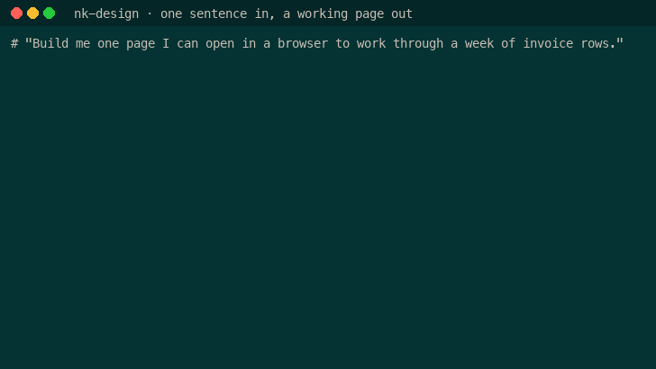</a><br><b><a href="https://github.com/NickkkLian/nk-design">nk-design</a></b> · creation<br>One sentence in: a working data tool whose first screen reconciles to the cent and whose every row shows its source.<br><code>git clone https://github.com/NickkkLian/nk-design ~/.claude/skills/nk-design</code></td><td width="50%" valign="top"><a href="https://github.com/NickkkLian/nk-data-story">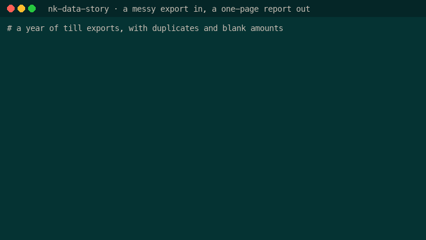</a><br><b><a href="https://github.com/NickkkLian/nk-data-story">nk-data-story</a></b> · creation<br>A messy export in: one page whose headline is the conclusion and where every figure carries its n, window and filter.<br><code>git clone https://github.com/NickkkLian/nk-data-story ~/.claude/skills/nk-data-story</code></td></tr>
<tr><td width="50%" valign="top"><a href="https://github.com/NickkkLian/nk-novel">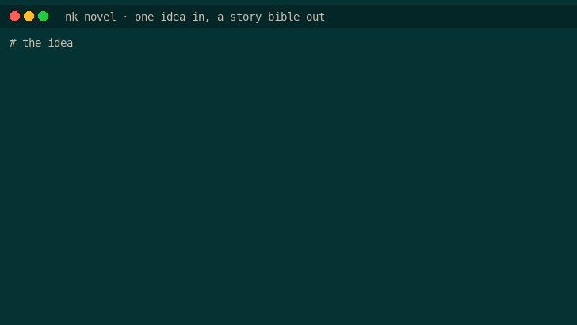</a><br><b><a href="https://github.com/NickkkLian/nk-novel">nk-novel</a></b> · creation<br>One story idea in: a staged novel plan, checked for holes, and a one-page story bible you can open.<br><code>git clone https://github.com/NickkkLian/nk-novel ~/.claude/skills/nk-novel</code></td><td width="50%" valign="top"><a href="https://github.com/NickkkLian/nk-landing">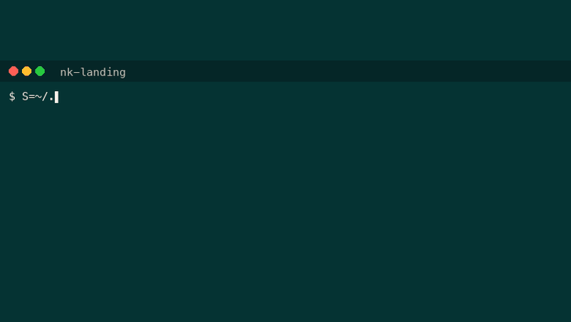</a><br><b><a href="https://github.com/NickkkLian/nk-landing">nk-landing</a></b> · creation<br>Describe a small business, get one page people can book from — nothing is sent until someone approves the exact words.<br><code>git clone https://github.com/NickkkLian/nk-landing ~/.claude/skills/nk-landing</code></td></tr>
<tr><td width="50%" valign="top"><a href="https://github.com/NickkkLian/nk-post-kit">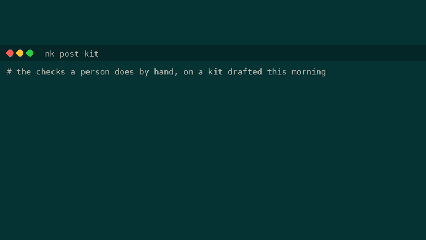</a><br><b><a href="https://github.com/NickkkLian/nk-post-kit">nk-post-kit</a></b> · discipline<br>Turn a finished repo into a thread, a video script and Chinese cards — every number traced to a file, and the posts drawn as pictures before they go out.<br><code>git clone https://github.com/NickkkLian/nk-post-kit ~/.claude/skills/nk-post-kit</code></td><td width="50%" valign="top"><a href="https://github.com/NickkkLian/nk-evidence-audit">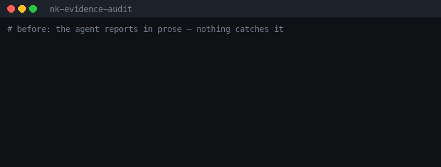</a><br><b><a href="https://github.com/NickkkLian/nk-evidence-audit">nk-evidence-audit</a></b> · discipline<br>&quot;Fixed and tested&quot; becomes raw output a second agent judges: supported, not supported, insufficient.<br><code>git clone https://github.com/NickkkLian/nk-evidence-audit ~/.claude/skills/nk-evidence-audit</code></td></tr>
<tr><td width="50%" valign="top"><a href="https://github.com/NickkkLian/nk-git-guardrail-hook">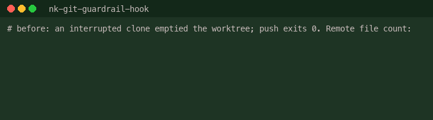</a><br><b><a href="https://github.com/NickkkLian/nk-git-guardrail-hook">nk-git-guardrail-hook</a></b> · discipline<br>Stops before force push, mass delete, repo-gone-public and curl|sh — each prompt names its incident.<br><code>git clone https://github.com/NickkkLian/nk-git-guardrail-hook ~/.claude/skills/nk-git-guardrail-hook</code></td><td width="50%" valign="top"><a href="https://github.com/NickkkLian/nk-publish-gate">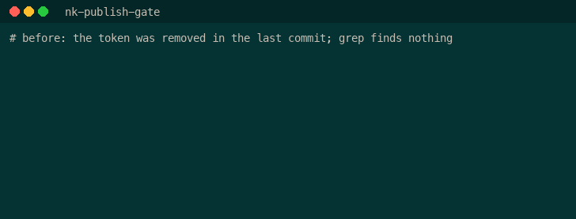</a><br><b><a href="https://github.com/NickkkLian/nk-publish-gate">nk-publish-gate</a></b> · discipline<br>Finds the path inside the nested archive and the secret still in your git history.<br><code>git clone https://github.com/NickkkLian/nk-publish-gate ~/.claude/skills/nk-publish-gate</code></td></tr>
<tr><td width="50%" valign="top"><a href="https://github.com/NickkkLian/nk-indent-guard">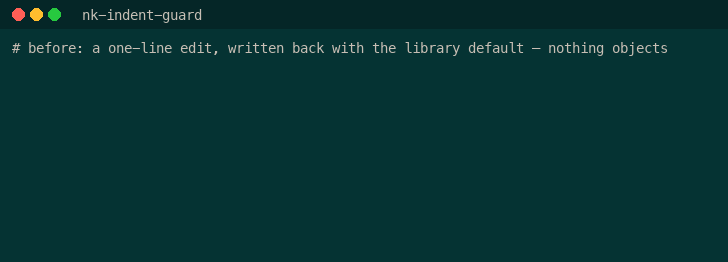</a><br><b><a href="https://github.com/NickkkLian/nk-indent-guard">nk-indent-guard</a></b> · discipline<br>A one-line JSON edit that re-indented the whole file no longer reaches the commit.<br><code>git clone https://github.com/NickkkLian/nk-indent-guard ~/.claude/skills/nk-indent-guard</code></td><td width="50%" valign="top"><a href="https://github.com/NickkkLian/nk-breakable-selftest">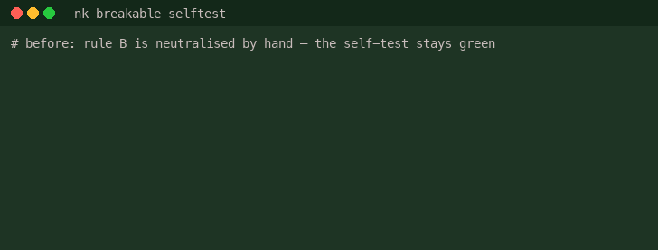</a><br><b><a href="https://github.com/NickkkLian/nk-breakable-selftest">nk-breakable-selftest</a></b> · discipline<br>Breaks the code your self-test guards, one line at a time, and names the checks that never react.<br><code>git clone https://github.com/NickkkLian/nk-breakable-selftest ~/.claude/skills/nk-breakable-selftest</code></td></tr>
<tr><td width="50%" valign="top"><a href="https://github.com/NickkkLian/nk-memory-with-conditions">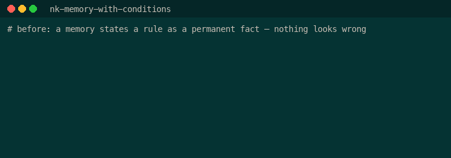</a><br><b><a href="https://github.com/NickkkLian/nk-memory-with-conditions">nk-memory-with-conditions</a></b> · discipline<br>Agent memories that say when they hold, plus a sentinel for index drift and silent truncation.<br><code>git clone https://github.com/NickkkLian/nk-memory-with-conditions ~/.claude/skills/nk-memory-with-conditions</code></td><td width="50%" valign="top"><a href="https://github.com/NickkkLian/nk-rules-that-land">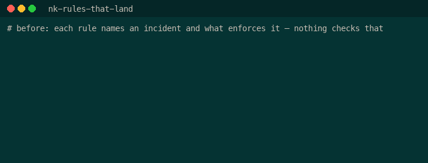</a><br><b><a href="https://github.com/NickkkLian/nk-rules-that-land">nk-rules-that-land</a></b> · discipline<br>Tells you which rules in your CLAUDE.md would actually stop an agent and which are wishes.<br><code>git clone https://github.com/NickkkLian/nk-rules-that-land ~/.claude/skills/nk-rules-that-land</code></td></tr>
<tr><td width="50%" valign="top"><a href="https://github.com/NickkkLian/nk-regression-baseline">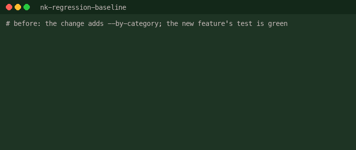</a><br><b><a href="https://github.com/NickkkLian/nk-regression-baseline">nk-regression-baseline</a></b> · discipline<br>Freezes what production code prints today so tomorrow&#x27;s refactor has to prove it changed nothing.<br><code>git clone https://github.com/NickkkLian/nk-regression-baseline ~/.claude/skills/nk-regression-baseline</code></td><td width="50%" valign="top"><a href="https://github.com/NickkkLian/nk-rewrite-coverage">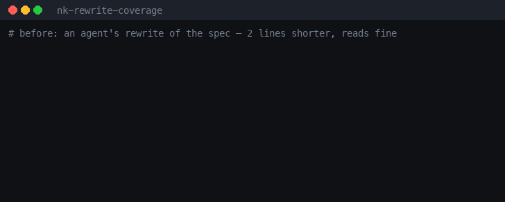</a><br><b><a href="https://github.com/NickkkLian/nk-rewrite-coverage">nk-rewrite-coverage</a></b> · discipline<br>After a rewrite, lists what the old version had and the new one lost — with a verdict required for each.<br><code>git clone https://github.com/NickkkLian/nk-rewrite-coverage ~/.claude/skills/nk-rewrite-coverage</code></td></tr>
<tr><td width="50%" valign="top"><a href="https://github.com/NickkkLian/nk-handoff-package">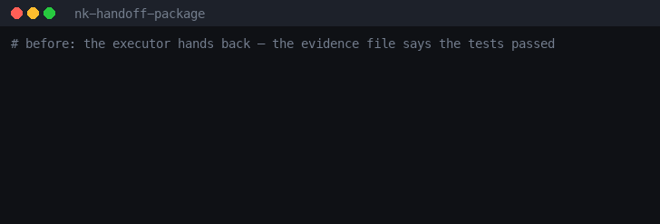</a><br><b><a href="https://github.com/NickkkLian/nk-handoff-package">nk-handoff-package</a></b> · discipline<br>Hand work to an agent with no context and get it back checkable, down to the trust root.<br><code>git clone https://github.com/NickkkLian/nk-handoff-package ~/.claude/skills/nk-handoff-package</code></td></tr>
</table>
<!-- gallery:end -->

- Every skill is one folder: a `SKILL.md` that says when to use it and where its rules came from, stdlib-only
  Python scripts, and references written from things that actually happened (incidents, review rounds).
- Every script ships a `--selftest` that was broken on purpose before publishing, to prove it reacts.
- Each skill lives in its own repository; this one is the directory, the plugin marketplace and the shared lint.

| Skill | What it does |
|---|---|
| [nk-evidence-audit](https://github.com/NickkkLian/nk-evidence-audit) | Turn "done, fixed, tested" into evidence a second agent judges. |
| [nk-git-guardrail-hook](https://github.com/NickkkLian/nk-git-guardrail-hook) | A PreToolUse hook for Claude Code that stops before the git and shell commands that have actually destroyed work — force push, git add -A in a shared checkout, making a repo public, pushing while behind the remote, a push that records a mass deletion, rm -rf on a project root, curl piped into a shell — and names the incident in the prompt. |
| [nk-publish-gate](https://github.com/NickkkLian/nk-publish-gate) | Privacy and secret gate to run before anything goes public — a repo, a release zip, a demo folder, a PDF. |
| [nk-indent-guard](https://github.com/NickkkLian/nk-indent-guard) | Stop a one-line edit to a JSON or YAML data file from re-indenting the whole file and burying the real change in a 400-line diff. |
| [nk-breakable-selftest](https://github.com/NickkkLian/nk-breakable-selftest) | Make a checker, validator, linter, gate or test suite prove it can fail. |
| [nk-memory-with-conditions](https://github.com/NickkkLian/nk-memory-with-conditions) | Write agent memories that say when they hold, and keep the memory directory honest. |
| [nk-rules-that-land](https://github.com/NickkkLian/nk-rules-that-land) | Write rules for an AI agent that actually change what it does. |
| [nk-regression-baseline](https://github.com/NickkkLian/nk-regression-baseline) | Freeze the byte-exact output of production code on its default inputs before you change it, and compare after. |
| [nk-rewrite-coverage](https://github.com/NickkkLian/nk-rewrite-coverage) | After rewriting a long document — a spec, a research report, a handbook — list what the old version had that the new one no longer mentions, and account for every item with a three-state verdict before the rewrite is accepted. |
| [nk-handoff-package](https://github.com/NickkkLian/nk-handoff-package) | Hand a line of work to an executor that has no context — another agent, a contractor, a future session — so that the work comes back checkable. |
| [nk-novel](https://github.com/NickkkLian/nk-novel) | Turn one story idea into a staged novel plan that holds together, plus a one-page visual story bible. |
| [nk-design](https://github.com/NickkkLian/nk-design) | Build a single-file data tool from one sentence (a review queue, a ledger, a tracker, an admin panel) in a design system where every number shows where it came from and what was not checked. |
| [nk-data-story](https://github.com/NickkkLian/nk-data-story) | Turn a CSV or Excel file into a one-page data report whose headline is the conclusion and where every figure states its denominator, window and filter. |
| [nk-post-kit](https://github.com/NickkkLian/nk-post-kit) | Turn a finished repository, tool or skill into a set of posts a person publishes by hand — a short X post, a 400–800 word build log, a 5–10 minute video script, a 60–90 second vertical cut, a GIF recording script, and a Chinese Xiaohongshu version — every claim traced to a file or a real run, with a gate that blocks invented numbers, superlatives, private names and contact details. |
| [nk-landing](https://github.com/NickkkLian/nk-landing) | Turn a written description of a small business — hours, services, price ranges, the questions customers actually ask — into one self-contained HTML page with a booking door, where every confirmation and every calendar write waits for a member of staff to approve that exact draft. |

## Install (example: nk-evidence-audit)

Pick one of four ways: three for Claude Code, one for OpenAI Codex. Skills load when a session starts, so open a **new** session after installing.

### 1 · Terminal, one command

```bash
git clone https://github.com/NickkkLian/nk-evidence-audit ~/.claude/skills/nk-evidence-audit
```

1. Run the command above (for one project only, clone into `.claude/skills/nk-evidence-audit` inside that project).
2. Start a new Claude Code session.
3. Check it loaded: type `/nk-evidence-audit` — it appears in the slash-command menu. Or just ask for the task; the skill triggers on its own.

### 2 · Claude Code in a terminal session (plugin)

The plugin route goes through the [nickkk-skills](https://github.com/NickkkLian/nickkk-skills) marketplace. Add it once; after that each skill is one command.

```
/plugin marketplace add NickkkLian/nickkk-skills
/plugin install nk-evidence-audit@nickkk-skills
```

1. In a Claude Code session, run the first line (once per machine).
2. Run the second line.
3. Start a new session (or run `/reload-plugins`). The skill shows up as `nk-evidence-audit:nk-evidence-audit`.

Without opening a session, the same two steps work from a shell: `claude plugin marketplace add NickkkLian/nickkk-skills` then `claude plugin install nk-evidence-audit@nickkk-skills`.

### 3 · Claude desktop app (Code tab)

**Add the marketplace first — Discover only searches marketplaces you have already added.**

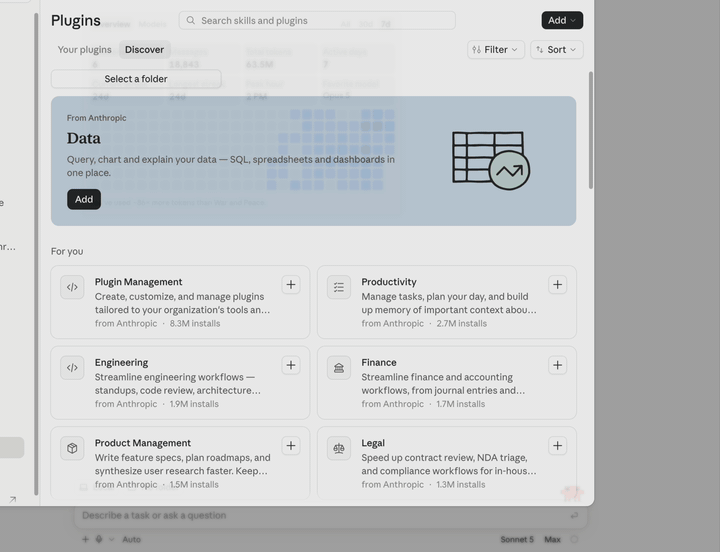

<sub>The repository list in this recording shows the recorder's own repositories because a GitHub account is connected; yours will show yours. Type the full name as in step 4.</sub>

1. In the chat box, type `/plugin marketplace` and press Enter (or open **Settings → Customize → Plugins**). The **Plugins** panel opens.
   <br>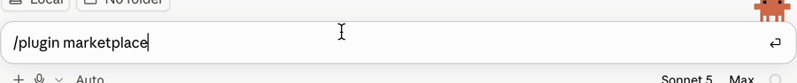
2. Top right, open **Add ▾** and choose **Add marketplace**.
   <br>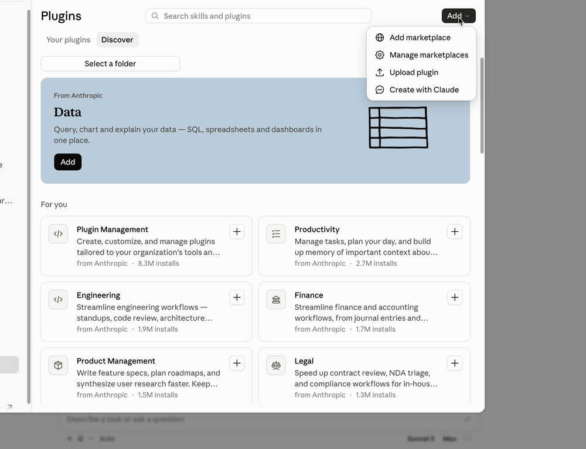
3. Choose **Add from a repository**.
   <br>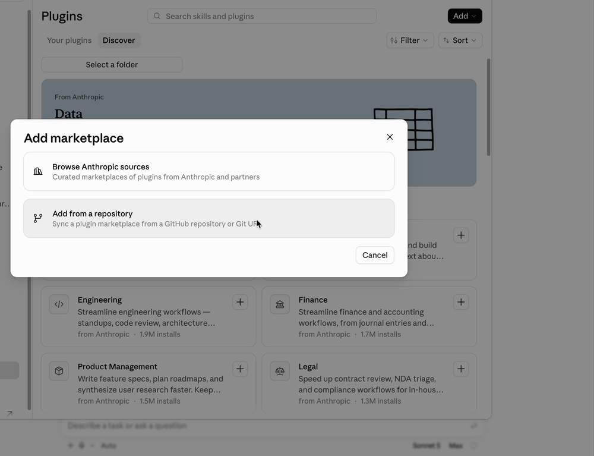
4. In **URL**, type the full `NickkkLian/nickkk-skills`. At the bottom of the list choose the row **Use "NickkkLian/nickkk-skills"**, then press **Sync**.
   <br>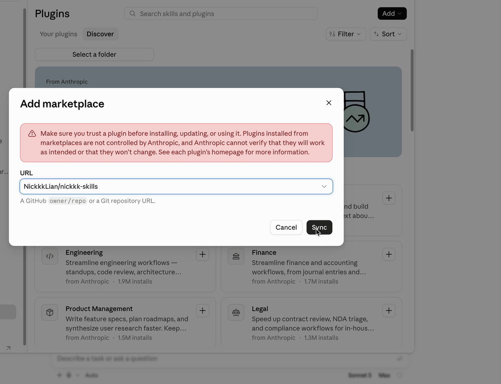
5. You land on **Discover**, filtered to the new marketplace (**Filter · 1**). Find **Nk evidence audit** and press **Add**. Installed ones show **✓ Added**.
   <br>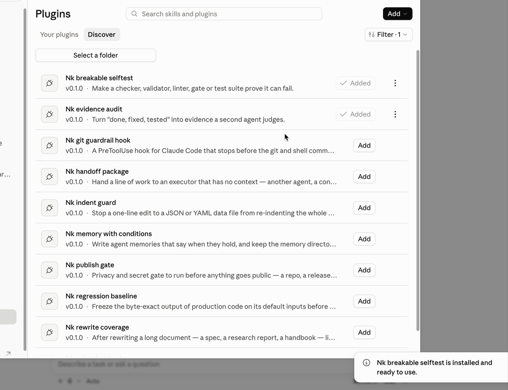
6. Close the panel and start a new session.

To try it for one session without installing anything: `claude --plugin-dir ./nk-evidence-audit` from a clone.

### 4 · OpenAI Codex CLI

```bash
git clone https://github.com/NickkkLian/nk-evidence-audit.git ~/.agents/skills/nk-evidence-audit
```

1. Run the command above (for one project only, clone into `.agents/skills/nk-evidence-audit` inside that project).
2. Start a new Codex session.
3. Check it loaded, without spending a model call: `codex debug prompt-input | grep -o -- '- nk-evidence-audit[a-z0-9:-]*' | sort -u` prints `- nk-evidence-audit:nk-evidence-audit:`. Codex adds the `nk-evidence-audit:` prefix because this repository also carries a Claude Code plugin manifest. Ask for the task and the skill triggers on its own, or type `$` and pick it from the list.

Every skill's own README repeats these steps with its own name.

## Compatibility

| Agent | Tested | What was checked |
|---|---|---|
| Claude Code (CLI 2.1.173, macOS) | 15 of 15 | In a fresh project with an isolated Claude config, inside a macOS sandbox that blocked reading the tester's ~/.claude folder (settings, session history, memory), Desktop, Documents and Downloads, SSH keys and git identity, a plain request that never names the skill triggered it and it ran its bundled script. The route 2 plugin commands were also run from a shell with an isolated config for 11 of 15 skills: marketplace add, install, list. |
| OpenAI Codex CLI (0.154.0-alpha.6.2, gpt-5.6-sol, low reasoning, macOS) | 15 of 15 | 15 of 15 skills: a plain request that never names the skill triggered it and it ran its bundled script. 14 are a plain yes. Partly: nk-git-guardrail-hook (see its README for why). |
| Cursor, Gemini CLI | no | Not tested. Their documentation says both read `~/.agents/skills`, the folder route 4 clones into; Gemini CLI asks before it activates a skill. |

Each skill's README has its own row with what that run did.

## Tools

`tools/skill_lint.py <skill-dir>` checks a skill folder the way these were checked before publishing:
frontmatter, name = folder, description length and a "when to use" clause, body length, a Provenance section,
scripts referenced through `${CLAUDE_SKILL_DIR}` with a path note for agents that do not fill it in,
every script with a `--selftest`, no local paths.
It has its own `--selftest`.

## Verify

```bash
python3 tools/skill_lint.py --selftest
```

## How these were built

- Every rule cites where it came from, an incident or a review round; nothing was added for an imagined risk.
- Every checker's self-test shares the production code path and was broken on purpose to prove it reacts.
- Detectors fail loud; the guardrail hook fails open.
- Every repository went through the nk-publish-gate skill (tree and full history) before its first push.

## Limits

- Tested with Claude Code and OpenAI Codex CLI on macOS (see Compatibility); Cursor and Gemini CLI were not
  tested. The scripts are stdlib Python and should run elsewhere, but Linux and Windows were not exercised.
- The self-tests prove each check reacts to the breaks that were tried; they do not prove there are no
  other failure modes.
- The demo GIFs are built from real runs on synthetic data, not from anyone's production repository.

## License

MIT.
